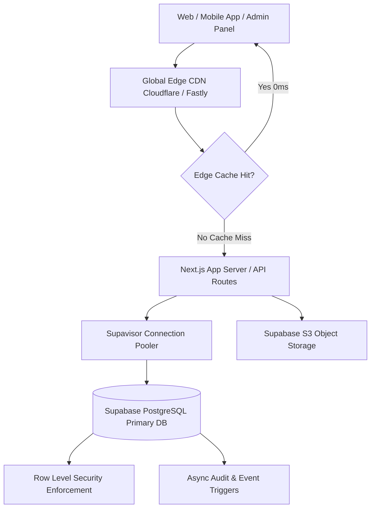

# Country Dairy — Scalable Database Schema & Architecture Blueprint

## 1. System Architecture & Scale Strategy

To ensure Country Dairy scales seamlessly from initial MVP launch to 100,000+ daily active users without architectural rewrites, we adhere to 5 core architectural principles:



### 1.1 Scaling Principles
1. **Stateless Edge Runtime**: All client applications (Web, Mobile, Admin) are fully decoupled from database connection limits using connection pooling (Supavisor / PgBouncer).
2. **Atomic Concurrency for Inventory**: Stock updates use atomic SQL decrement operations (`WHERE stock >= qty`) to prevent race conditions during high-concurrency flash sales without table locks.
3. **Extensible Schema Design (Extensible EAV/JSONB)**: Core fields are strictly typed columns, while future dynamic attributes (e.g. seasonal parameters, nutritional details, custom promo metadata) use GIN-indexed `jsonb` fields.
4. **Cache-Aside & Stale-While-Revalidate (SWR)**: Storefront product catalogs load with `Cache-Control: s-maxage=60, stale-while-revalidate=600`, reducing database read load by over 95%.
5. **Decoupled Service & Repository Pattern**: Frontend UI components never call raw database endpoints directly. All data access is gated through TypeScript Service contracts, making it trivial to swap or mock backends.

---

## 2. Robust & Extensible PostgreSQL Database Schema

### 2.1 Enums & Types
```sql
-- Roles
CREATE TYPE user_role AS ENUM (
  'SUPER_ADMIN',
  'CATALOG_MANAGER',
  'ORDER_MANAGER',
  'DELIVERY_DRIVER',
  'CUSTOMER'
);

-- Product & Variant Status
CREATE TYPE product_status AS ENUM (
  'DRAFT',
  'LIVE',
  'ARCHIVED',
  'OUT_OF_STOCK'
);

-- Packaging Types
CREATE TYPE packaging_type AS ENUM (
  'GLASS_JAR',
  'METAL_DOLCHI',
  'FOOD_GRADE_TIN',
  'PET_BOTTLE',
  'ECO_POUCH'
);

-- Order Status
CREATE TYPE order_status AS ENUM (
  'PENDING',
  'CONFIRMED',
  'PROCESSING',
  'OUT_FOR_DELIVERY',
  'DELIVERED',
  'CANCELLED'
);
```

---

### 2.2 Table Definitions

#### 1. `user_profiles` (Extensible User & Staff Management)
```sql
CREATE TABLE user_profiles (
  id UUID PRIMARY KEY REFERENCES auth.users(id) ON DELETE CASCADE,
  email VARCHAR(255) NOT NULL UNIQUE,
  full_name VARCHAR(255) NOT NULL,
  phone_number VARCHAR(20),
  role user_role NOT NULL DEFAULT 'CUSTOMER',
  is_active BOOLEAN NOT NULL DEFAULT TRUE,
  metadata JSONB DEFAULT '{}'::jsonb, -- Flexible metadata (e.g. address history, driver vehicle details)
  last_login_at TIMESTAMPTZ,
  created_at TIMESTAMPTZ NOT NULL DEFAULT NOW(),
  updated_at TIMESTAMPTZ NOT NULL DEFAULT NOW()
);

-- Indexing for role lookups and security checks
CREATE INDEX idx_user_profiles_role ON user_profiles(role);
CREATE INDEX idx_user_profiles_phone ON user_profiles(phone_number) WHERE phone_number IS NOT NULL;
```

---

#### 2. `categories` (Hierarchical Product Taxonomy)
```sql
CREATE TABLE categories (
  id UUID PRIMARY KEY DEFAULT gen_random_uuid(),
  name VARCHAR(100) NOT NULL UNIQUE,
  slug VARCHAR(120) NOT NULL UNIQUE,
  description TEXT,
  icon_name VARCHAR(50),
  display_order INT NOT NULL DEFAULT 0,
  is_active BOOLEAN NOT NULL DEFAULT TRUE,
  created_at TIMESTAMPTZ NOT NULL DEFAULT NOW(),
  updated_at TIMESTAMPTZ NOT NULL DEFAULT NOW()
);

CREATE INDEX idx_categories_slug ON categories(slug);
```

---

#### 3. `products` (Core Master Product Catalog)
```sql
CREATE TABLE products (
  id UUID PRIMARY KEY DEFAULT gen_random_uuid(),
  category_id UUID REFERENCES categories(id) ON DELETE SET NULL,
  title VARCHAR(255) NOT NULL,
  slug VARCHAR(255) NOT NULL UNIQUE,
  tagline VARCHAR(255),
  story_description TEXT, -- Farm origin story / rich details
  status product_status NOT NULL DEFAULT 'DRAFT',
  badge_text VARCHAR(50), -- e.g., "Best Seller", "100% Organic"
  is_featured BOOLEAN NOT NULL DEFAULT FALSE,
  display_order INT NOT NULL DEFAULT 0,
  nutrition_facts JSONB DEFAULT '{}'::jsonb, -- e.g. {"fat": "99.8g", "energy": "897 kcal"}
  specifications JSONB DEFAULT '{}'::jsonb, -- e.g. {"shelf_life": "6 months", "storage": "Cool dry place"}
  metadata JSONB DEFAULT '{}'::jsonb, -- Future extensibility
  created_by UUID REFERENCES user_profiles(id),
  created_at TIMESTAMPTZ NOT NULL DEFAULT NOW(),
  updated_at TIMESTAMPTZ NOT NULL DEFAULT NOW()
);

CREATE INDEX idx_products_slug ON products(slug);
CREATE INDEX idx_products_status ON products(status);
CREATE INDEX idx_products_category ON products(category_id);
CREATE INDEX idx_products_featured ON products(is_featured) WHERE is_featured = TRUE;
```

---

#### 4. `product_variants` (Multi-Size Pricing & Inventory)
```sql
CREATE TABLE product_variants (
  id UUID PRIMARY KEY DEFAULT gen_random_uuid(),
  product_id UUID NOT NULL REFERENCES products(id) ON DELETE CASCADE,
  sku VARCHAR(100) NOT NULL UNIQUE,
  size_label VARCHAR(50) NOT NULL, -- e.g., "500ml", "1 Litre Jar", "2.5L Metal Dolchi"
  selling_price NUMERIC(10, 2) NOT NULL CHECK (selling_price >= 0),
  mrp_price NUMERIC(10, 2) NOT NULL CHECK (mrp_price >= selling_price),
  stock_quantity INT NOT NULL DEFAULT 0 CHECK (stock_quantity >= 0),
  low_stock_threshold INT NOT NULL DEFAULT 10,
  packaging_type packaging_type NOT NULL DEFAULT 'GLASS_JAR',
  image_url TEXT, -- Specific variant photo override
  is_active BOOLEAN NOT NULL DEFAULT TRUE,
  display_order INT NOT NULL DEFAULT 0,
  created_at TIMESTAMPTZ NOT NULL DEFAULT NOW(),
  updated_at TIMESTAMPTZ NOT NULL DEFAULT NOW()
);

CREATE INDEX idx_variants_product ON product_variants(product_id);
CREATE INDEX idx_variants_stock ON product_variants(stock_quantity);
CREATE INDEX idx_variants_sku ON product_variants(sku);
```

---

#### 5. `product_images` (Amazon/Anveshan Style Multi-Image Gallery)
```sql
CREATE TABLE product_images (
  id UUID PRIMARY KEY DEFAULT gen_random_uuid(),
  product_id UUID NOT NULL REFERENCES products(id) ON DELETE CASCADE,
  image_url TEXT NOT NULL,
  alt_text VARCHAR(255),
  display_order INT NOT NULL DEFAULT 0,
  is_primary BOOLEAN NOT NULL DEFAULT FALSE,
  created_at TIMESTAMPTZ NOT NULL DEFAULT NOW()
);

CREATE INDEX idx_product_images_product ON product_images(product_id, display_order);
```

---

#### 6. `hero_carousel` (Dynamic Homepage Banners)
```sql
CREATE TABLE hero_carousel (
  id UUID PRIMARY KEY DEFAULT gen_random_uuid(),
  title VARCHAR(255) NOT NULL,
  subtitle TEXT,
  badge_text VARCHAR(100),
  cta_label VARCHAR(100) NOT NULL DEFAULT 'Explore Shop',
  cta_link VARCHAR(255) NOT NULL DEFAULT '/products',
  desktop_image_url TEXT NOT NULL,
  mobile_image_url TEXT NOT NULL,
  overlay_opacity INT NOT NULL DEFAULT 20 CHECK (overlay_opacity BETWEEN 0 AND 100),
  sort_order INT NOT NULL DEFAULT 0,
  is_active BOOLEAN NOT NULL DEFAULT TRUE,
  created_at TIMESTAMPTZ NOT NULL DEFAULT NOW(),
  updated_at TIMESTAMPTZ NOT NULL DEFAULT NOW()
);

CREATE INDEX idx_hero_carousel_order ON hero_carousel(sort_order) WHERE is_active = TRUE;
```

---

#### 7. `audit_logs` (Enterprise Security & Action Tracking)
```sql
CREATE TABLE audit_logs (
  id UUID PRIMARY KEY DEFAULT gen_random_uuid(),
  actor_id UUID REFERENCES user_profiles(id) ON DELETE SET NULL,
  actor_name VARCHAR(255) NOT NULL,
  actor_email VARCHAR(255) NOT NULL,
  action VARCHAR(100) NOT NULL, -- e.g. "PRODUCT_UPDATE", "PRICE_CHANGE", "USER_DEACTIVATED"
  entity_type VARCHAR(100) NOT NULL, -- e.g. "product", "variant", "user"
  entity_id UUID,
  old_data JSONB,
  new_data JSONB,
  ip_address VARCHAR(45),
  created_at TIMESTAMPTZ NOT NULL DEFAULT NOW()
);

CREATE INDEX idx_audit_logs_actor ON audit_logs(actor_id);
CREATE INDEX idx_audit_logs_entity ON audit_logs(entity_type, entity_id);
CREATE INDEX idx_audit_logs_created ON audit_logs(created_at DESC);
```

---

#### 8. `cms_modules` (Announcement Banner, WhatsApp Templates, Feature Flags)
```sql
CREATE TABLE cms_modules (
  key VARCHAR(100) PRIMARY KEY, -- e.g. "announcement_banner", "whatsapp_template", "feature_flags"
  value JSONB NOT NULL DEFAULT '{}'::jsonb,
  is_published BOOLEAN NOT NULL DEFAULT TRUE,
  updated_by UUID REFERENCES user_profiles(id),
  updated_at TIMESTAMPTZ NOT NULL DEFAULT NOW()
);
```

---

#### 9. `lab_certificates` (Batch Purity & Quality Reports)
```sql
CREATE TABLE lab_certificates (
  id UUID PRIMARY KEY DEFAULT gen_random_uuid(),
  batch_code VARCHAR(100) NOT NULL UNIQUE,
  product_id UUID REFERENCES products(id) ON DELETE SET NULL,
  pdf_url TEXT NOT NULL,
  test_date DATE NOT NULL,
  purity_percentage NUMERIC(5,2),
  notes TEXT,
  created_at TIMESTAMPTZ NOT NULL DEFAULT NOW()
);

CREATE INDEX idx_lab_cert_batch ON lab_certificates(batch_code);
```

---

## 3. Frontend & Backend Design Patterns

### 3.1 Service & Repository Pattern (Decoupled Layering)

To keep UI components lightweight and independent of backend API changes, we define strict TypeScript Interfaces and Service implementations:

```
[ UI Components ]  -->  [ Custom React Hooks (e.g. useProducts) ]
                                   │
                                   ▼
                       [ IProductRepository Contract ]
                                   │
                    ┌──────────────┴──────────────┐
                    ▼                             ▼
       [ SupabaseProductRepository ]   [ MockProductRepository ]
```

#### TypeScript Contract (`apps/admin/src/services/types.ts`)
```typescript
export interface IProductRepository {
  getProducts(filter?: ProductFilter): Promise<Product[]>;
  getProductById(id: string): Promise<Product | null>;
  createProduct(data: CreateProductDTO): Promise<Product>;
  updateProduct(id: string, data: UpdateProductDTO): Promise<Product>;
  archiveProduct(id: string): Promise<void>;
  updateVariantStock(variantId: string, newStock: number): Promise<void>;
}
```

---

### 3.2 Strategy Pattern for Payment / Ordering Gateways

Extensible ordering architecture allowing seamless switching between WhatsApp pre-fill ordering and full Online Payment (Razorpay/Stripe):

```typescript
export interface IOrderGatewayStrategy {
  type: 'WHATSAPP' | 'ONLINE_PAYMENT';
  processOrder(order: OrderPayload): Promise<OrderResult>;
}

export class WhatsAppOrderStrategy implements IOrderGatewayStrategy {
  type = 'WHATSAPP' as const;
  async processOrder(order: OrderPayload): Promise<OrderResult> {
    const formattedMessage = formatWhatsAppMessage(order);
    const whatsappUrl = `https://wa.me/${STORE_CONFIG.whatsappNumber}?text=${encodeURIComponent(formattedMessage)}`;
    return { success: true, redirectUrl: whatsappUrl };
  }
}

export class RazorpayOrderStrategy implements IOrderGatewayStrategy {
  type = 'ONLINE_PAYMENT' as const;
  async processOrder(order: OrderPayload): Promise<OrderResult> {
    // Future Razorpay checkout launcher logic
    throw new Error('Online payments coming soon');
  }
}
```

---

### 3.3 Factory Pattern for Analytics Tracking

Supports multi-provider analytics without cluttering UI code:

```typescript
export interface IAnalyticsTracker {
  trackEvent(eventName: string, properties?: Record<string, any>): void;
}

export class AnalyticsFactory {
  private static trackers: IAnalyticsTracker[] = [
    new VercelAnalyticsTracker(),
    new CustomEventTracker()
  ];

  static track(eventName: string, properties?: Record<string, any>) {
    this.trackers.forEach(t => t.trackEvent(eventName, properties));
  }
}
```

---

### 3.4 Concurrency Control for Inventory Stock (Race Condition Guard)

When multiple customers order the last remaining jar of Bilona Ghee simultaneously:

```sql
-- Atomic Decrement SQL Function to prevent negative inventory locks
CREATE OR REPLACE FUNCTION decrement_variant_stock(
  p_variant_id UUID,
  p_quantity INT
) RETURNS BOOLEAN AS $$
DECLARE
  v_rows_updated INT;
BEGIN
  UPDATE product_variants
  SET stock_quantity = stock_quantity - p_quantity,
      updated_at = NOW()
  WHERE id = p_variant_id 
    AND stock_quantity >= p_quantity;

  GET DIAGNOSTICS v_rows_updated = ROW_COUNT;
  RETURN v_rows_updated > 0;
END;
$$ LANGUAGE plpgsql SECURITY DEFINER;
```

---

## 4. High-Traffic Performance & Optimization Checklist

1. **Database Connection Pooling**:
   - Web application connects via **Supavisor Transaction Pooler** on port 6543 to maintain 10,000+ simultaneous client sessions over ~20 database connections.
2. **Edge CDN Dynamic Caching**:
   - Public GET routes (`/api/products`, `/api/hero`) cached at CDN Edge with `stale-while-revalidate=600`.
3. **Client-Side Image Optimization Pipeline**:
   - HTML5 Canvas WebP auto-compression reduces 5MB uploads to ~150KB before uploading to S3 buckets, saving 95%+ of bandwidth.
4. **Database Indexing**:
   - Covered index lookups for `slug`, `status`, `product_id`, `category_id`, and `created_at` timestamp sorting.
