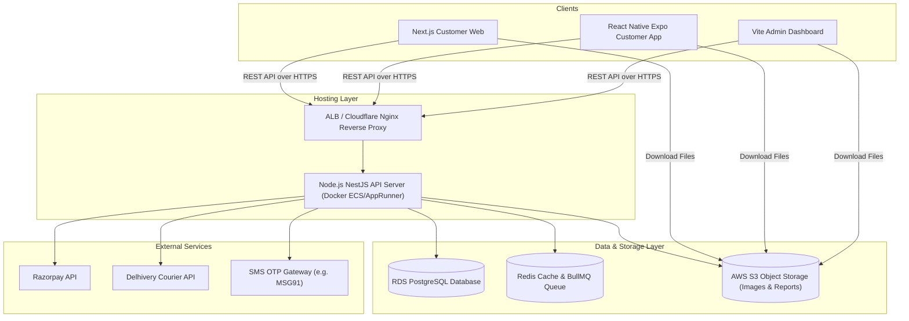
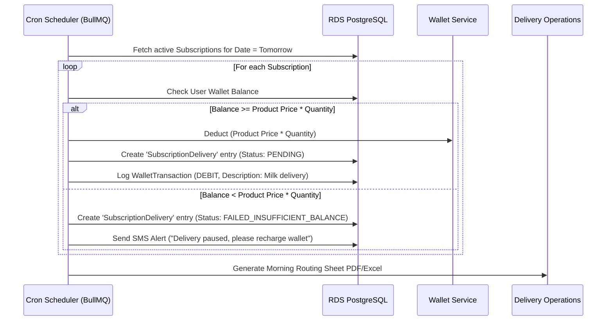
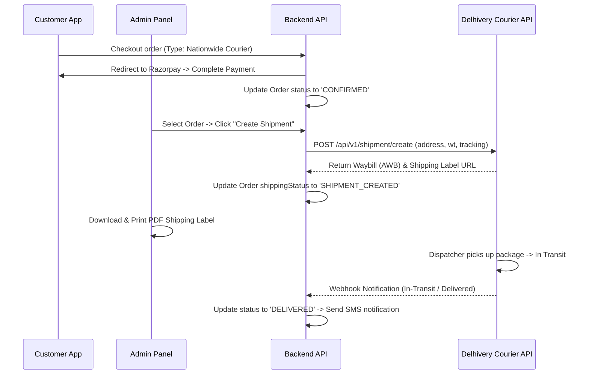
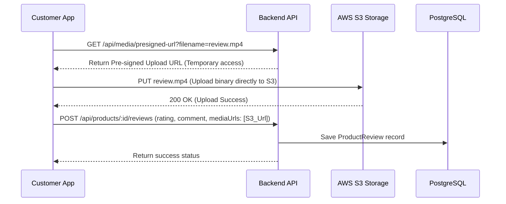

# High-Level Design (HLD) - Country Dairy

This document specifies the system architecture, service communication channels, and design principles for the Country Dairy e-commerce platform.

---

## 1. System Topology & Architecture

The system utilizes a modular monolith backend (NestJS) serving three frontend client applications managed under a unified monorepo workspace.

---

## 2. Infrastructure & Deployment Architecture

To host this setup in production, we propose the following AWS cloud architecture:

1.  **VPC & Subnets**:
    *   Public subnets for Application Load Balancer (ALB).
    *   Private subnets for ECS (Elastic Container Service) running the NestJS Nest app, Redis, and RDS PostgreSQL instance.
2.  **App Hosting (API & Admin)**:
    *   **Backend (NestJS)**: Packaged as a Docker container, deployed to AWS ECS Fargate or AWS App Runner.
    *   **Customer Web (Next.js)**: Deployed to Vercel or AWS Amplify (takes care of SSR caching, globally optimized edge routing).
    *   **Admin Web (Vite React)**: Built as static HTML/JS, hosted on AWS S3 and distributed globally via CloudFront CDN.
3.  **Database**:
    *   AWS RDS PostgreSQL (db.t4g.small or similar for MVP).
    *   Automatic daily backups enabled.
    *   Connection pooling managed by PgBouncer (or Prisma Accelerate) to handle scaling connections from NestJS workers.
4.  **Cache & Queues (Redis)**:
    *   Used for:
        *   OTP expiry and verification states.
        *   Cron tasks & background job queueing (e.g., Delhivery shipment creation retries, morning delivery sheet compilation).
5.  **CI/CD Pipeline**:
    *   GitHub Actions running on push to `main` branch.
    *   Runs TypeScript check, ESLint, and builds artifacts.
    *   Deploys Next.js to Vercel, Admin to S3/CloudFront, and NestJS to ECS (via AWS ECR Docker registry push).

---

## 3. Data Flow & Subsystems

### A. Subscription Execution Flow
Dairy subscription orders require nightly processing to schedule deliveries for the next morning.

### B. Standard Logistics Flow (Nationwide)
For dry products (ghee, honey, oil) that are sent via nationwide couriers:

### C. Media Storage & Review Upload Flow
To manage large binary assets efficiently without overloading the NestJS API:

1.  **Product Images & Videos (Admin Upload)**:
    *   Admin uploads files via Vite Admin panel.
    *   API uploads to **AWS S3 / Cloudinary** bucket.
    *   URLs are stored in `Product.imageUrls` and `Product.videoUrls`.
    *   Delivered to customers using **CloudFront CDN / Cloudinary Optimizer** for low-latency playback.

2.  **Customer Review Images & Videos**:
    *   Customer uploads photo/video reviews using the Customer App/Web.
    *   **Direct-to-S3 Upload Flow** (Pre-signed URLs) is used:

---

## 4. Expansion Design Strategy
To ensure the HLD can handle non-dairy catalog expansion seamlessly:
*   **Flexible Inventory Rules**: Subscriptions can be active only on items marked `isSubscriptionAllowed = true` (e.g., milk, paneer, curd, fresh cream). Standard items (e.g. 5L Ghee) will only permit one-time purchases and will be excluded from the subscription scheduler.
*   **Logistics Dispatch Router**: When checkouts are executed, the system automatically tags items based on shelf-life or category. If a cart contains a mix, it enforces split checkouts (fresh delivery schedule for local dairy, and standard shipment for courier products).
*   **Dynamic Attributes Pattern**: We avoid adding custom database columns for dairy attributes. Product metadata is stored in a JSONB type column `nutritionFacts` and dynamic properties (e.g., origin farm location, pressing method for oils, pasteurization temperature for dairy) to enable dynamic rendering on the frontend.
