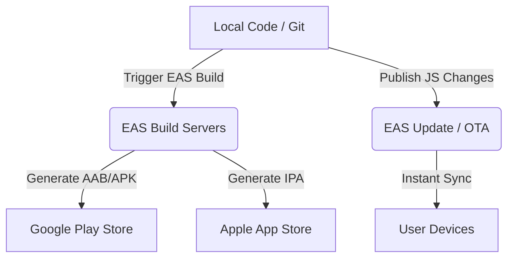

# Country Dairy Mobile App - Deployment Strategy

This document outlines the step-by-step deployment strategy for the Country Dairy mobile application built using React Native and Expo (SDK 54).

## Table of Contents
1. [Deployment Architecture](#1-deployment-architecture)
2. [EAS (Expo Application Services) Overview](#2-eas-expo-application-services-overview)
3. [Prerequisites](#3-prerequisites)
4. [Step-by-Step Build & Release Flow](#4-step-by-step-build--release-flow)
5. [OTA (Over-The-Air) Updates Strategy](#5-ota-over-the-air-updates-strategy)
6. [CI/CD Automation](#6-cicd-automation)

---

## 1. Deployment Architecture



---

## 2. EAS (Expo Application Services) Overview
We leverage **Expo Application Services (EAS)** for compiling, signing, and submitting our application binaries. This avoids the need for a macOS machine for Android builds, and simplifies code signing certificate generation for iOS.

*   **EAS Build:** Cloud-based compilation for `.apk` (Android testing), `.aab` (Android Store upload), and `.ipa` (iOS App Store upload).
*   **EAS Submit:** Auto-submits built binaries to Google Play Console and Apple App Store Connect.
*   **EAS Update:** Relies on Over-the-Air (OTA) updates to push bug-fixes and UI changes directly to users instantly without store review.

---

## 3. Prerequisites
Before initiating builds, ensure the following accounts are set up:
1.  **Expo Developer Account:** Register at [expo.dev](https://expo.dev).
2.  **Apple Developer Account:** Enrollment in the Apple Developer Program ($99/yr) is required for iOS App Store distribution.
3.  **Google Play Console Account:** A one-time registration fee ($25) is required for publishing on Android.
4.  **EAS CLI Installation:** Install the EAS tool globally on the builder machine:
    ```bash
    npm install -g eas-cli
    ```

---

## 4. Step-by-Step Build & Release Flow

### Step 4.1: Project Setup and Configuration
Log in to Expo and link the project:
```bash
# Log in to your Expo account
eas login

# Initialize EAS configuration (creates eas.json)
eas build:configure
```

### Step 4.2: Build Configurations (`eas.json`)
Ensure `apps/mobile/eas.json` is configured for production and preview profiles:
```json
{
  "cli": {
    "version": ">= 10.0.0"
  },
  "build": {
    "development": {
      "developmentClient": true,
      "distribution": "internal"
    },
    "preview": {
      "distribution": "internal"
    },
    "production": {}
  },
  "submit": {
    "production": {}
  }
}
```

### Step 4.3: Generating Builds
Run the following commands to trigger cloud builds:

*   **Android Production Build (AAB):**
    ```bash
    eas build --platform android --profile production
    ```
*   **iOS Production Build (IPA):**
    ```bash
    eas build --platform ios --profile production
    ```
*   **Combined Multi-Platform Build:**
    ```bash
    eas build --platform all --profile production
    ```

*Note: Expo will guide you to log in to Apple / Google Play to automatically manage provisioning profiles and signing certificates.*

### Step 4.4: App Store Submissions
Once builds complete, they can be uploaded directly to the respective developer consoles:
```bash
# Submit Android build to Google Play Console (Closed Testing / Production track)
eas submit --platform android

# Submit iOS build to TestFlight / App Store Connect
eas submit --platform ios
```

---

## 5. OTA (Over-The-Air) Updates Strategy
Since the app doesn't introduce custom native libraries (and runs on standard Expo modules), **most future bug fixes and style changes can be pushed instantly** via Over-The-Air (OTA) updates, bypassing app store review entirely.

1.  **Configure Updates:** Ensure `app.json` has the update configuration active pointing to the Expo project owner:
    ```json
    "updates": {
      "url": "https://u.expo.dev/your-project-id"
    }
    ```
2.  **Publishing Updates:**
    ```bash
    # Publish changes to the production branch
    eas update --branch production --message "Fix homepage carousel and quantity selector"
    ```

---

## 6. CI/CD Automation
To automate releases, configure a GitHub Actions workflow (`.github/workflows/mobile-release.yml`) to build and deploy when changes are merged to the `main` branch:

```yaml
name: Mobile App CD
on:
  push:
    branches: [main]
    paths:
      - 'apps/mobile/**'

jobs:
  build:
    runs-on: ubuntu-latest
    steps:
      - name: Checkout Repository
        uses: actions/checkout@v4
        with:
          submodules: 'recursive'

      - name: Setup Node.js
        uses: actions/setup-node@v4
        with:
          node-version: 18

      - name: Install EAS CLI
        run: npm install -g eas-cli

      - name: Install Dependencies
        run: npm ci

      - name: Build Android Release
        run: eas build --platform android --profile production --non-interactive
        env:
          EXPO_TOKEN: ${{ secrets.EXPO_TOKEN }}
```
