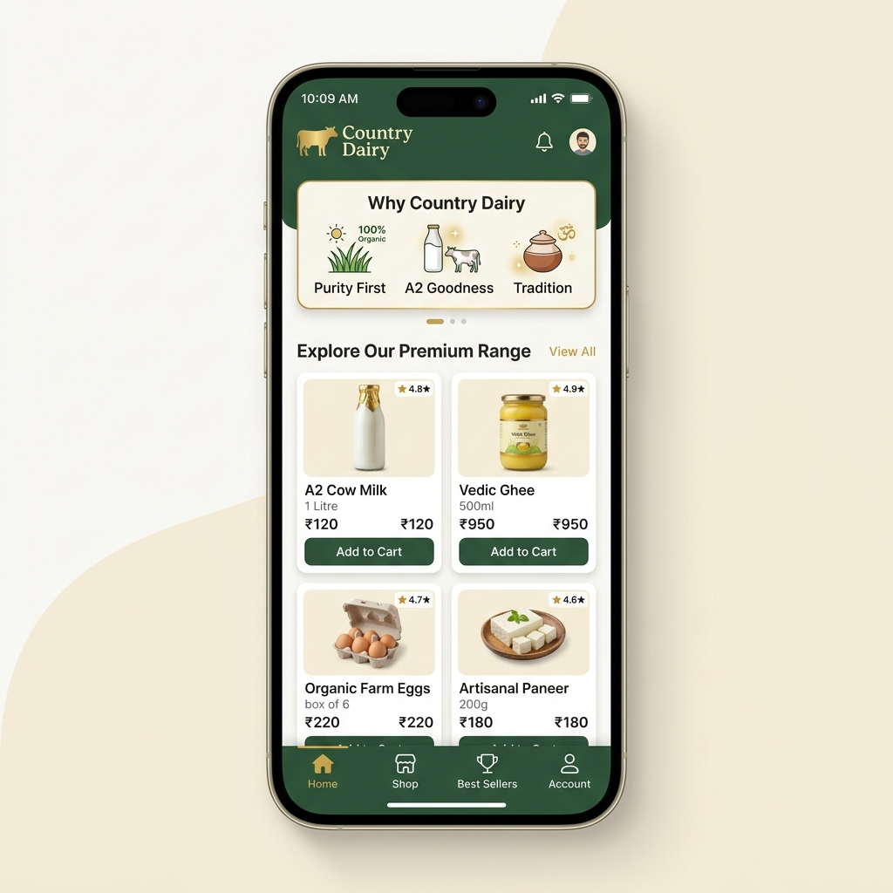
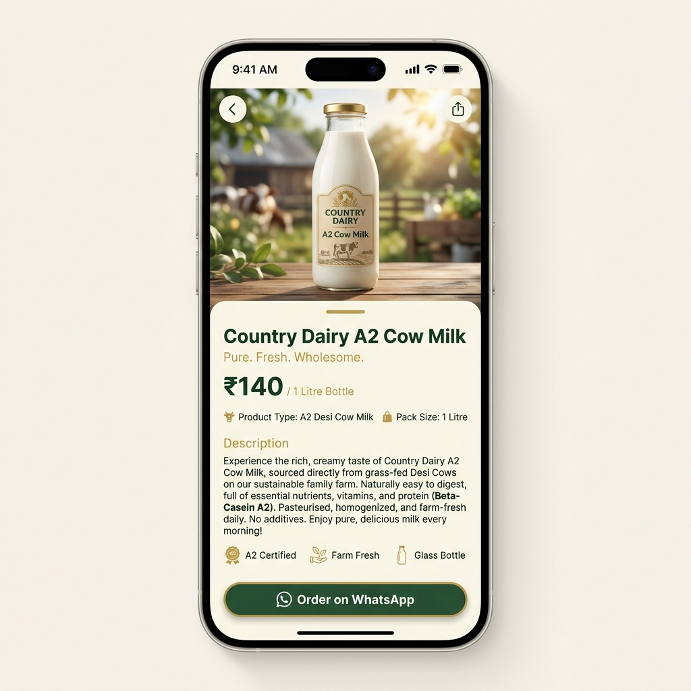

# Country Dairy - Mobile App UX Flows (MVP)

This document outlines the user experience and flows for the Country Dairy mobile application. For the MVP, the mobile app will mirror the website's functionality by routing all orders directly to WhatsApp.

## 1. App Launch & Onboarding
**Scenario:** A user opens the app for the first time.
* **Splash Screen:** Displays the Country Dairy logo on a dark Forest Green background for 2 seconds.
* **State Check:** If there are no cached products, the app fetches the initial catalogue from the backend (or uses hardcoded fallback data if offline).
* **Navigation:** Automatically routes to the Home Screen.

## 2. Home Screen (Product Catalogue)
**Scenario:** Browsing the available products and learning about the brand.
* **Header:** Sticky header with the Country Dairy logo and a notification/profile icon (profile disabled behind feature flag for MVP).
* **Value Banner ("Why Country Dairy"):** Horizontal scrolling or grid cards highlighting brand pillars: 100% Organic, A2 Goodness, Tradition, Sustainable.
* **Product Grid:** Vertical scrolling list of products.
    * Each card displays the product image, title, pack size (e.g., 1 Litre), price, and a quick "View" or "Order" CTA.
    * *Note on Ratings:* Ratings are hidden behind the `ENABLE_PRODUCT_RATINGS` flag.

### Mockup: Home Screen

## 3. Product Details Screen
**Scenario:** A user taps on a product card from the Home Screen to view more details.
* **Image Gallery:** Large, edge-to-edge high-quality image of the product (e.g., A2 Cow Milk glass bottle).
* **Information:** Product title, short description, price, and pack size.
* **Nutrition & Specs:** Toggle tabs or a vertically scrolling section for Nutrition Facts, Shelf Life, and Packaging details.
* **Sticky CTA (Order Action):** A prominent, sticky button at the bottom of the screen saying "Order on WhatsApp" with the WhatsApp logo.

### Mockup: Product Details

## 4. Checkout Flow (WhatsApp Redirection)
**Scenario:** The user decides to purchase the product.
1. The user taps the **Order on WhatsApp** button.
2. The app uses deep linking (`whatsapp://send?phone=...`) to open the WhatsApp application on the device.
3. The message input is pre-filled using the `WHATSAPP_MESSAGE_TEMPLATE`:
   > "Hi! I'd like to order:\n- Country Dairy A2 Cow Milk — ₹95\nPlease help me place this order. Thank you!"
4. The transaction and delivery logistics are handled manually by the admin via WhatsApp.

---

## Future Enhancements (Post-MVP)
* **Authentication Flow:** OTP-based login via phone number.
* **In-App Cart & Checkout:** Managing a basket of goods and checking out via a payment gateway (e.g., Razorpay/Stripe).
* **Subscriptions:** Daily/weekly subscription management screens.
* **Order History:** Tracking past orders and managing deliveries.
