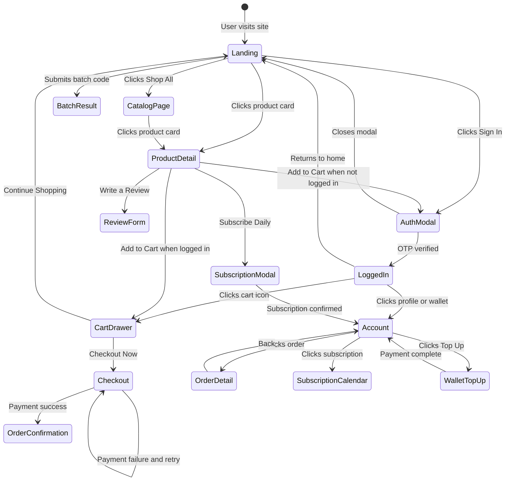

# Country Dairy — Complete UX Flow Document

This document maps **every screen, interaction, and state transition** across the entire product. It is the single source of truth for what the UI must do.

---

## Part A: Customer Web (Next.js) — Complete Screen Map

### Screen 1: Landing Page (`/`)

```
┌─────────────────────────────────────────────────────────┐
│ NAVBAR (sticky)                                         │
│ [CD Logo] Country Dairy    Shop  Purity  Story  Contact │
│                                        [Sign In] [🛒 2] │
├─────────────────────────────────────────────────────────┤
│ HERO SECTION                                            │
│ ┌─────────────────────┐  ┌────────────────────────────┐ │
│ │ 🌿 Native Cow Milk  │  │ 🛡️ Purity Batch Certificate│ │
│ │                     │  │                            │ │
│ │ Farm Fresh.         │  │ Every bottle is lab tested │ │
│ │ Organic.            │  │ [BATCH-2026-MILK01_______] │ │
│ │ Pure Happiness.     │  │ [Verify Batch Purity]      │ │
│ │                     │  │                            │ │
│ │ [Shop All] [Purity] │  │ ── Results Card ──         │ │
│ └─────────────────────┘  │ Purity: 100%  Fat: 4.25%   │ │
│                          │ SNF: 8.8%   Lab: NABL      │ │
│                          │ Adulteration: All Negative  │ │
│                          └────────────────────────────┘ │
├─────────────────────────────────────────────────────────┤
│ VALUE BANNER (green bar)                                │
│ 🌿 100% Organic │ 🥛 A2 Beta Casein │ 🌱 Grass-Fed │ ♻️ │
├─────────────────────────────────────────────────────────┤
│ BESTSELLERS SHELF                                       │
│ ┌──────────┐ ┌──────────┐ ┌──────────┐ ┌──────────┐    │
│ │ [Image]  │ │ [Image]  │ │ [Image]  │ │ [Image]  │    │
│ │ Glass Btl│ │ Glass Jar│ │ PET Btl  │ │ Glass Jar│    │
│ │ ★ 5.0    │ │ ★ 4.8    │ │ ★ 4.5    │ │ ★ 4.9    │    │
│ │ A2 Milk  │ │ A2 Ghee  │ │ Mustard  │ │ Forest   │    │
│ │          │ │          │ │ Oil      │ │ Honey    │    │
│ │ ₹95  1L  │ │ ₹1450 1L │ │ ₹320 1L  │ │ ₹450 500g│    │
│ │[Add Cart]│ │[Add Cart]│ │[Add Cart]│ │[Add Cart]│    │
│ │[Subscribe│ │          │ │          │ │          │    │
│ └──────────┘ └──────────┘ └──────────┘ └──────────┘    │
├─────────────────────────────────────────────────────────┤
│ TESTIMONIALS / REVIEWS CAROUSEL (Phase 2)               │
│ "Best milk I've ever tasted..." — Amit S. ★★★★★         │
├─────────────────────────────────────────────────────────┤
│ FOOTER                                                  │
│ Country Dairy │ NABL Audited │ Support & Locations       │
└─────────────────────────────────────────────────────────┘
```

**Interactions:**
- `[Sign In]` → Opens **Auth Modal** (Screen 8)
- `[🛒]` → Opens **Cart Drawer** (Screen 7)
- `[Shop All Products]` → Scrolls to Bestsellers OR navigates to `/products`
- `[Verify Batch Purity]` → Inline result card appears below input
- `[Add to Cart]` → If logged in: adds item, badge count increments. If not logged in: opens Auth Modal first
- `[Subscribe Daily]` → Opens **Subscription Modal** (Screen 9) — only on `isSubscriptionAllowed` products
- Product card click → Navigates to `/products/[slug]` (Screen 3)

---

### Screen 2: Catalog / Shop Page (`/products`)

```
┌─────────────────────────────────────────────────────────┐
│ NAVBAR                                                  │
├─────────────────────────────────────────────────────────┤
│ Our Products                                            │
│                                                         │
│ [🔍 Search products...          ]                       │
│                                                         │
│ FILTER CHIPS:                                           │
│ [All] [Dairy] [Oils] [Honey] [Subscription Only]        │
│                                                         │
│ SORT: [Relevance ▼]  (Price Low→High, Rating, Newest)   │
│                                                         │
│ ┌──────────┐ ┌──────────┐ ┌──────────┐ ┌──────────┐    │
│ │ Product  │ │ Product  │ │ Product  │ │ Product  │    │
│ │ Card     │ │ Card     │ │ Card     │ │ Card     │    │
│ │ (same as │ │ (same as │ │ (same as │ │ (same as │    │
│ │ homepage)│ │ homepage)│ │ homepage)│ │ homepage)│    │
│ └──────────┘ └──────────┘ └──────────┘ └──────────┘    │
│                                                         │
│ [Load More] or infinite scroll                          │
├─────────────────────────────────────────────────────────┤
│ FOOTER                                                  │
└─────────────────────────────────────────────────────────┘
```

**Interactions:**
- Search input → Filters products by name (client-side or debounced API)
- Category chips → Filter by category, active chip highlighted
- Sort dropdown → Re-orders product grid
- Product card click → `/products/[slug]`

---

### Screen 3: Product Detail Page (`/products/[slug]`)

```
┌─────────────────────────────────────────────────────────┐
│ NAVBAR                                                  │
├─────────────────────────────────────────────────────────┤
│ Breadcrumb: Home > Shop > A2 Cow Milk                   │
│                                                         │
│ ┌──────────────────┐  ┌───────────────────────────────┐ │
│ │                  │  │ 🌿 Dairy · Glass Bottle        │ │
│ │  [Product Image  │  │                               │ │
│ │   Carousel /     │  │ Country Dairy A2 Cow Milk     │ │
│ │   Gallery]       │  │ ★★★★★ 5.0 (12 reviews)       │ │
│ │                  │  │                               │ │
│ │  ○ ○ ● ○         │  │ ₹95  per 1 Litre             │ │
│ │  [▶ Play Video]  │  │                               │ │
│ │                  │  │ Pure A2 milk sourced from     │ │
│ └──────────────────┘  │ happy grass-fed cows...       │ │
│                       │                               │ │
│                       │ QUANTITY: [- 1 +]             │ │
│                       │                               │ │
│                       │ [🛒 Add to Cart — ₹95]        │ │
│                       │ [📅 Subscribe Daily — ₹85]    │ │
│                       └───────────────────────────────┘ │
│                                                         │
│ ── PRODUCT DETAILS TABS ──                              │
│ [Nutrition Facts] [Purity Certificate] [Details]        │
│                                                         │
│ ┌─ Nutrition Facts ─────────────────────────────────┐   │
│ │ Fat: 4.2%  │ Energy: 64 kcal  │ Calcium: 120mg   │   │
│ │ Protein: 3.3g │ Shelf Life: 2 days                │   │
│ └───────────────────────────────────────────────────┘   │
│                                                         │
│ ── PURITY CERTIFICATE ──                                │
│ (Inline batch lookup same as hero, pre-filled for       │
│  this product's latest batch code)                      │
│                                                         │
│ ── CUSTOMER REVIEWS ──                                  │
│ Average: ★★★★★ 5.0 from 12 reviews                     │
│ Rating Distribution:                                    │
│ ★★★★★ ████████████████████ 10                           │
│ ★★★★  ████               2                             │
│ ★★★   ·                  0                             │
│ ★★    ·                  0                             │
│ ★     ·                  0                             │
│                                                         │
│ [Write a Review] (shown only if logged in & purchased)  │
│                                                         │
│ ┌─ Review Card ─────────────────────────────────────┐   │
│ │ ★★★★★  Amit S.  ·  July 3, 2026                  │   │
│ │ "Extremely Fresh!"                                │   │
│ │ Tastes exactly like farm fresh milk. No adulter.. │   │
│ │ [📷 photo1.jpg] [📷 photo2.jpg]                   │   │
│ └───────────────────────────────────────────────────┘   │
│ ┌─ Review Card ─────────────────────────────────────┐   │
│ │ ★★★★★  Priya R.  ·  June 28, 2026                │   │
│ │ "Kids love it"                                    │   │
│ │ My children drink this without any fuss...        │   │
│ └───────────────────────────────────────────────────┘   │
│                                                         │
│ ── YOU MAY ALSO LIKE ──                                 │
│ [Product Card] [Product Card] [Product Card]            │
│                                                         │
├─────────────────────────────────────────────────────────┤
│ FOOTER                                                  │
└─────────────────────────────────────────────────────────┘
```

**Interactions:**
- Image carousel → Swipe/click dots to browse product images
- Play Video → Plays product video (farm tour / cold-press demo)
- Quantity adjuster → `[-]` decrements (min 1), `[+]` increments
- `[Add to Cart]` → Adds with selected quantity, shows toast notification
- `[Subscribe Daily]` → Opens Subscription Modal (Screen 9)
- Tabs → Switch between Nutrition, Purity Certificate, Details
- `[Write a Review]` → Opens inline review form (rating stars, title, comment, photo/video upload)
- Review media thumbnails → Lightbox overlay for full-size view
- "You May Also Like" cards → Navigate to those product pages

---

### Screen 4: Account Dashboard (`/account`)

> **Requires authentication.** If not logged in → redirect to `/` with Auth Modal open.

```
┌─────────────────────────────────────────────────────────┐
│ NAVBAR (logged in state: Wallet + Logout)                │
├─────────────────────────────────────────────────────────┤
│ My Account                                              │
│                                                         │
│ SIDEBAR / TABS:                                         │
│ [Overview] [Orders] [Subscriptions] [Wallet] [Addresses]│
│                                                         │
│ ══════ OVERVIEW TAB ══════                              │
│ ┌───────────┐ ┌───────────┐ ┌───────────┐              │
│ │ 💰 Wallet │ │ 📦 Orders │ │ 📅 Active │              │
│ │   ₹1,500  │ │    12     │ │ Subs: 2   │              │
│ │           │ │           │ │           │              │
│ │[Top Up]   │ │[View All] │ │[Manage]   │              │
│ └───────────┘ └───────────┘ └───────────┘              │
│                                                         │
│ Recent Orders:                                          │
│ ┌───────────────────────────────────────────────┐       │
│ │ ORD-10492 │ July 5 │ A2 Milk (6L) │ ₹570     │       │
│ │ Status: CONFIRMED │ Payment: PAID │ [Details] │       │
│ └───────────────────────────────────────────────┘       │
│ ┌───────────────────────────────────────────────┐       │
│ │ ORD-10493 │ July 4 │ Vedic Ghee  │ ₹1,450    │       │
│ │ Status: SHIPPED │ Track: AWB-4819.. │[Details] │       │
│ └───────────────────────────────────────────────┘       │
│                                                         │
│ ══════ ORDERS TAB ══════                                │
│ Filter: [All] [Confirmed] [Shipped] [Delivered]         │
│ Full order list with status badges, tracking links,     │
│ and "Reorder" buttons                                   │
│                                                         │
│ ══════ SUBSCRIPTIONS TAB ══════                         │
│ ┌───────────────────────────────────────────────┐       │
│ │ A2 Cow Milk │ 2L/day │ DAILY │ Status: ACTIVE │       │
│ │ Next delivery: July 6, 2026                   │       │
│ │ [Pause] [Edit Quantity] [Cancel]               │       │
│ └───────────────────────────────────────────────┘       │
│                                                         │
│ Delivery Calendar (current month):                      │
│ ┌─────────────────────────────────────────┐             │
│ │ Mon Tue Wed Thu Fri Sat Sun             │             │
│ │  1   2   3   4   5   6   7              │             │
│ │ [✓] [✓] [✓] [✓] [✓] [—] [—]            │             │
│ │  8   9  10  11  12  13  14              │             │
│ │ [·] [·] [·] [·] [·] [—] [—]            │             │
│ └─────────────────────────────────────────┘             │
│ ✓ = delivered  · = scheduled  — = off day  ✕ = skipped  │
│                                                         │
│ ══════ WALLET TAB ══════                                │
│ Current Balance: ₹1,500                                 │
│ [Top Up Wallet]  (opens Razorpay for amount entry)      │
│                                                         │
│ Transaction History:                                    │
│ ┌─────────────────────────────────────────┐             │
│ │ +₹2,000 │ CREDIT │ Wallet Recharge     │             │
│ │ -₹190   │ DEBIT  │ Milk delivery Jul 5 │             │
│ │ -₹190   │ DEBIT  │ Milk delivery Jul 4 │             │
│ └─────────────────────────────────────────┘             │
│                                                         │
│ ══════ ADDRESSES TAB ══════                             │
│ ┌───────────────────────────────────────┐               │
│ │ 📍 Sector 62, Noida, 201301 [DEFAULT] │               │
│ │ [Edit] [Delete]                       │               │
│ └───────────────────────────────────────┘               │
│ [+ Add New Address]                                     │
│                                                         │
├─────────────────────────────────────────────────────────┤
│ FOOTER                                                  │
└─────────────────────────────────────────────────────────┘
```

**Interactions:**
- Tab navigation → Switches between Overview / Orders / Subscriptions / Wallet / Addresses
- `[Top Up]` → Opens Razorpay checkout for wallet recharge
- `[View All]` → Switches to Orders tab
- `[Details]` on order → Expands or navigates to order detail view
- `[Pause]` / `[Cancel]` subscription → Confirmation dialog → API call
- `[Edit Quantity]` → Inline quantity adjuster
- Calendar day click → Skip/unskip a future delivery
- `[+ Add New Address]` → Inline form (street, city, state, pincode, set as default)

---

### Screen 5: Order Detail Page (`/orders/[orderId]`)

```
┌─────────────────────────────────────────────────────────┐
│ NAVBAR                                                  │
├─────────────────────────────────────────────────────────┤
│ ← Back to Orders                                        │
│                                                         │
│ Order #ORD-10492                                        │
│ Placed: July 5, 2026                                    │
│ Status: [CONFIRMED ●]   Payment: [PAID ✓]               │
│                                                         │
│ ── ITEMS ──                                             │
│ ┌───────────────────────────────────────────┐           │
│ │ A2 Cow Milk │ Qty: 6 │ ₹95 × 6 = ₹570    │           │
│ └───────────────────────────────────────────┘           │
│                                                         │
│ Subtotal:        ₹570                                   │
│ Delivery:        FREE                                   │
│ Total:           ₹570                                   │
│                                                         │
│ ── DELIVERY ──                                          │
│ Type: LOCAL DELIVERY                                    │
│ Address: Sector 62, Noida, 201301                       │
│                                                         │
│ ── TRACKING (if COURIER) ──                             │
│ Carrier: DELHIVERY                                      │
│ AWB: DELHIVERY-9831948123                               │
│ Status: IN TRANSIT                                      │
│ [Track on Delhivery →]                                  │
│                                                         │
│ ── TIMELINE ──                                          │
│ ● July 5, 09:00 — Order placed                         │
│ ● July 5, 09:01 — Payment confirmed                    │
│ ○ July 5, 14:00 — Out for delivery (estimated)         │
│                                                         │
│ [Reorder Items]  [Need Help?]                           │
├─────────────────────────────────────────────────────────┤
│ FOOTER                                                  │
└─────────────────────────────────────────────────────────┘
```

---

### Screen 6: Checkout Flow (`/checkout`)

```
┌─────────────────────────────────────────────────────────┐
│ NAVBAR (simplified — only logo + cart count)             │
├─────────────────────────────────────────────────────────┤
│ Checkout                                                │
│                                                         │
│ STEP 1: DELIVERY ADDRESS                                │
│ ┌───────────────────────────────────────┐               │
│ │ 📍 Sector 62, Noida [DEFAULT] (●)    │               │
│ └───────────────────────────────────────┘               │
│ ┌───────────────────────────────────────┐               │
│ │ 📍 MG Road, Delhi (○)                │               │
│ └───────────────────────────────────────┘               │
│ [+ Add New Address]                                     │
│                                                         │
│ STEP 2: ORDER SUMMARY                                   │
│ ┌───────────────────────────────────────┐               │
│ │ A2 Cow Milk × 2        ₹190          │               │
│ │ Forest Honey × 1       ₹450          │               │
│ ├───────────────────────────────────────┤               │
│ │ Subtotal               ₹640          │               │
│ │ Delivery               FREE          │               │
│ │ TOTAL                  ₹640          │               │
│ └───────────────────────────────────────┘               │
│                                                         │
│ STEP 3: PAYMENT METHOD                                  │
│ (●) Pay via Razorpay (UPI / Card / Netbanking)          │
│ (○) Pay from Wallet (Balance: ₹1,500)                   │
│                                                         │
│ [Place Order — ₹640]                                    │
│                                                         │
│ 🔒 Payments secured by Razorpay                         │
├─────────────────────────────────────────────────────────┤
│ FOOTER                                                  │
└─────────────────────────────────────────────────────────┘
```

**Interactions:**
- Select address radio → Updates delivery address for order
- `[+ Add New Address]` → Expands inline form
- `[Place Order]` → If Razorpay: opens Razorpay checkout popup. If Wallet: deducts and confirms
- On success → Navigate to `/orders/[orderId]` with success banner

---

### Screen 7: Cart Drawer (Slide-over Panel)

```
                              ┌──────────────────────────┐
                              │ Shopping Cart         [✕] │
                              │────────────────────────── │
                              │ A2 Cow Milk               │
                              │ ₹95 each                  │
                              │ [- 2 +]          ₹190     │
                              │                  [Remove] │
                              │────────────────────────── │
                              │ Forest Honey              │
                              │ ₹450 each                 │
                              │ [- 1 +]          ₹450     │
                              │                  [Remove] │
                              │────────────────────────── │
                              │                           │
                              │ Subtotal:        ₹640     │
                              │ Shipping:        FREE     │
                              │ ─────────────────         │
                              │ Total:           ₹640     │
                              │                           │
                              │ [Checkout Now]            │
                              │ [Continue Shopping]       │
                              └──────────────────────────┘
```

**Interactions:**
- `[✕]` → Closes drawer
- `[-]` / `[+]` → Updates quantity (API call), min 1. At 0 → removes item
- `[Remove]` → Removes item from cart
- `[Checkout Now]` → If logged in: navigates to `/checkout`. If not: opens Auth Modal
- `[Continue Shopping]` → Closes drawer
- Empty state: Shopping bag icon + "Your cart is empty" + [Start Shopping] link

---

### Screen 8: Auth Modal (Login / OTP)

```
┌───────────────────────────────────┐
│ Welcome Back                  [✕] │
│ Enter your mobile number to       │
│ retrieve your wallet & orders     │
│                                   │
│ STEP 1 (Phone Entry):             │
│ Mobile Number:                    │
│ [+919876543210________________]   │
│ [Request OTP]                     │
│                                   │
│ ─ or after OTP sent ─             │
│                                   │
│ STEP 2 (OTP Verification):        │
│ 6-digit Code:                     │
│ [1 2 3 4 5 6]                     │
│ [Verify Code]                     │
│                                   │
│ ⓘ Dev code: 123456               │
│ [Resend OTP] (enabled after 30s)  │
└───────────────────────────────────┘
```

**State transitions:**
1. Modal opens → Step 1 (phone input)
2. User submits phone → API `POST /auth/send-otp` → Success → Step 2 (OTP input)
3. User submits OTP → API `POST /auth/verify-otp` → Success → Modal closes, user logged in
4. Invalid OTP → Error message "Invalid code, try again"
5. `[Resend OTP]` → Timer resets, re-calls send-otp

---

### Screen 9: Subscription Modal

```
┌───────────────────────────────────┐
│ Configure Subscription        [✕] │
│                                   │
│ Product: A2 Cow Milk — ₹95/L     │
│                                   │
│ Schedule:                         │
│ [DAILY ●] [ALTERNATE] [CUSTOM]    │
│                                   │
│ Volume Per Day:                   │
│ [- 2 +] Litres                    │
│                                   │
│ Custom Days (if CUSTOM):          │
│ [Mon ●] [Tue ●] [Wed] [Thu ●]    │
│ [Fri] [Sat] [Sun]                 │
│                                   │
│ ┌───────────────────────────────┐ │
│ │ Wallet debit per run: ₹190   │ │
│ └───────────────────────────────┘ │
│                                   │
│ [Confirm Subscription]            │
└───────────────────────────────────┘
```

---

### Screen 10: Review Submission Form (inline on Product Detail)

```
┌───────────────────────────────────────┐
│ Write a Review                        │
│                                       │
│ Your Rating: ★ ★ ★ ★ ☆  (click stars)│
│                                       │
│ Title:                                │
│ [Extremely Fresh!_________________]   │
│                                       │
│ Comment:                              │
│ [Tastes exactly like farm fresh...]   │
│ [                                 ]   │
│                                       │
│ Add Photos/Videos:                    │
│ [📷 Upload] [📹 Upload]               │
│ Preview: [thumb1] [thumb2] [✕]        │
│                                       │
│ [Submit Review]                       │
└───────────────────────────────────────┘
```

**Flow:** Upload images via presigned URL → Submit review with mediaUrls

---

## Part B: Admin Panel (Vite React) — Complete Screen Map

### Admin Screen 1: Dashboard Overview (`/`)

```
┌─────────────────────────────────────────────────────────┐
│ SIDEBAR               │ Dashboard Overview              │
│ ┌───────────────────┐ │                                 │
│ │ 📊 Overview       │ │ ┌──────┐ ┌──────┐ ┌──────┐     │
│ │ 📦 Inventory      │ │ │Today │ │Pend- │ │Rev-  │     │
│ │ 🛒 Orders         │ │ │Sales │ │ing   │ │enue  │     │
│ │ 🚚 Logistics      │ │ │₹12K  │ │ 4    │ │₹89K  │     │
│ │ 📅 Subscriptions  │ │ └──────┘ └──────┘ └──────┘     │
│ │ 👥 Customers      │ │                                 │
│ │ 💰 Wallets        │ │ Recent Orders Table             │
│ │ ⭐ Reviews        │ │ ┌──────────────────────────┐    │
│ │ 📋 Lab Reports    │ │ │ ORD-10492 │ Amit │ ₹570  │    │
│ │ 🛣️ Routes         │ │ │ ORD-10493 │ Priya│ ₹1450 │    │
│ └───────────────────┘ │ └──────────────────────────┘    │
│                       │                                 │
│                       │ Active Subscriptions: 47        │
│                       │ Low Stock Alerts: 2 items       │
└─────────────────────────────────────────────────────────┘
```

### Admin Screen 2: Inventory Management (`/inventory`)
- Full product table: Name, Price, Stock, Category, Batch Code, Verified badge
- Actions: Edit product, Update stock, Upload lab report, Toggle subscription allowed
- `[+ Add Product]` → Form with fields for name, slug, description, price, stock, category, images, videos, nutrition facts, metadata

### Admin Screen 3: Order Management (`/orders`)
- Filterable order table: Order ID, Customer, Items, Total, Delivery Type, Status, Payment, Date
- Actions per order: View details, Update status, Create shipment (if COURIER), Print invoice
- `[Create Shipment]` → Opens Delhivery booking form (weight, dimensions) → Returns AWB + label PDF

### Admin Screen 4: Logistics Dashboard (`/logistics`)
- **Local Deliveries tab**: Morning delivery sheet (grouped by route/area), Print daily route sheet
- **Courier Shipments tab**: Pending shipments, booked AWBs, delivery status tracking
- `[Generate Morning Sheet]` → Creates printable PDF of today's local deliveries

### Admin Screen 5: Subscription Manager (`/subscriptions`)
- Table of all subscriptions: Customer, Product, Frequency, Status, Next Delivery
- Actions: Pause, Resume, Cancel subscription
- Delivery log: History of all subscription deliveries with status

### Admin Screen 6: Customer Profiles (`/customers`)
- Searchable customer table: Name, Phone, Email, Wallet Balance, Orders Count
- Click → Customer detail: Profile info, order history, wallet transactions, active subscriptions

### Admin Screen 7: Wallet Management (`/wallets`)
- Wallet adjustment tool: Search customer → Credit/Debit amount with reason
- Recent transactions log across all customers

### Admin Screen 8: Reviews Moderation (`/reviews`)
- All product reviews table: Product, Customer, Rating, Date, Media
- Actions: Approve, Flag, Delete review

### Admin Screen 9: Lab Reports (`/lab-reports`)
- Upload and manage batch purity certificates
- Associate batch codes with products
- View all uploaded lab reports with parameters

---

## Part C: Mobile App (Expo React Native) — Screen Map

> **Deferred to after web is complete.** Will mirror the Customer Web flows with native navigation patterns.

### Planned Screens:
1. **Home Feed** — Hero banner + bestsellers grid
2. **Search / Browse** — Category filters + product list
3. **Product Detail** — Image carousel, buy/subscribe CTA, reviews
4. **Cart** — Full-screen cart with checkout button
5. **Checkout** — Address selection + payment method
6. **Account** — Profile, orders, subscriptions, wallet, addresses
7. **Subscription Calendar** — Visual calendar with skip/edit per day
8. **Login** — Phone + OTP (full screen, not modal)
9. **Push Notifications** — Order updates, delivery alerts, low wallet warnings

---

## State Transition Diagram — Complete User Journey



---

## Edge Cases & Error States

| Scenario | Behavior |
|---|---|
| API backend offline | Products fall back to hardcoded mock data, auth uses mock user |
| Empty cart checkout | Checkout button disabled, shows "Cart is empty" |
| Insufficient wallet for subscription | Show warning: "Balance low. Top up ₹X to continue deliveries" |
| Invalid batch code | Error message below input: "Batch code not found" |
| OTP expired/invalid | Error toast: "Invalid code. Please request a new OTP" |
| Product out of stock | "Add to Cart" disabled, shows "Out of Stock" badge |
| Session expired (401) | Auto-clear token, redirect to landing, open Auth Modal |
| Payment failure | Stay on checkout page, show error banner, allow retry |
| Network timeout | Toast notification: "Connection error. Please try again" |
| Review already submitted | Hide "Write a Review", show "You reviewed this product" |
